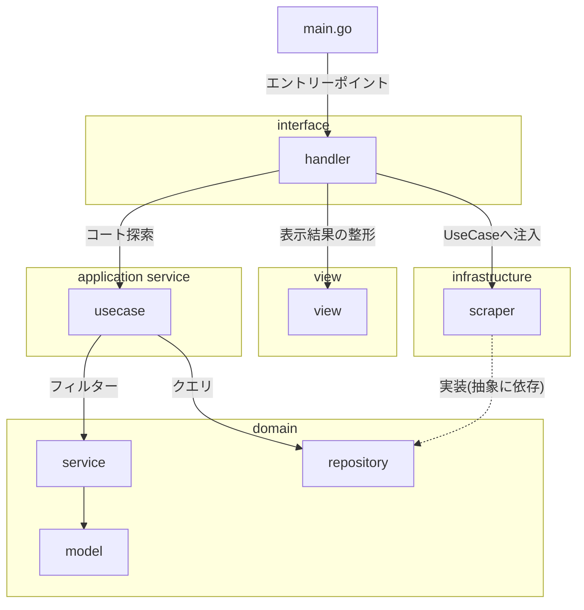

# scrape-line-bot

## Requirements

- install
  - docker
  - docker-compose
  - GNU Make
- registration
  - fly.io

## Usage

### build

```:sh
make build
```

### local run

```:sh
make run
```

### login to fly.io

```:sh
make auth
```

### 1st deploy application on fly.io

```:sh
make app_start
```

### deploy application to fly.io

```:sh
make deploy
```

### destroy application

```:sh
make destroy
```

## Architecture


